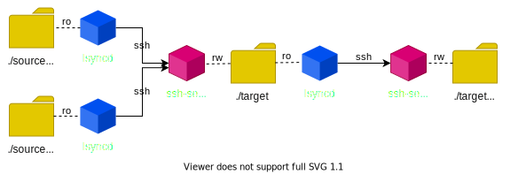

# Docker containers for syncing files via ssh by lsyncd

This is one way syncing solution so we need source and destination implementation.
* **[solargis/lsyncd](https://hub.docker.com/r/solargis/lsyncd)** - docker image for source, with `lsync`,`ssh-client`,`rsync`
* **[solargis/openssh-server](https://hub.docker.com/r/solargis/openssh-server)** - docker image fror target, based on [linuxserver/openssh-server](https://github.com/linuxserver/docker-openssh-server) with added `rsync`

Booth images aditionaly contains packages `net-tools`, `tree`, `vim` for easer debuging during trouble shooting. Because services need to be high available.

## solargis/openssh-server
See documentation of base image [linuxserver/openssh-server](https://hub.docker.com/r/linuxserver/openssh-server).\
Plus you can:

* Instead of using enviroment properties `PUBLIC_KEY` and `PUBLIC_KEY_FILE` use rather `AUTHORIZED_KEYS` and `AUTHORIZED_KEYS_FILE`.\
  This properties correctly merge multiple keys (seppareted by new line) to *authorized_keys*.\
  Plus *authorized_key* can be updated without reboot by command:
  ```bash
  docker exec $container merge-audthorized_keys
  ```

* You can use `ssh-entrypoint.sh` as command for authorized keys which set default working directory to `/data` for all ssh connections (works also with `lsync`, `scp`, etc.).\
  Usage:
  ```bash
  -e AUTHORIZED_KEYS='command="ssh-entrypoint.sh \"${SSH_ORIGINAL_COMMAND:-bash -l}\"" ssh-rsa AAAAXY...Z== comment'
  ```


## solargis/lsyncd
Image uses `lsyncd` preconfiured by [docker-entrypoint.sh](./docker-bin/docker-entrypoint.sh).
Configuration consist of two steps:
1. ssh client with configured by `~/.ssh/config` like:
   ```SSH Config
    Host $TARGET_HOST
      User $TARGET_USER
      Port $TARGET_SSH_PORT
      IdentityFile $SSH_KEY_FILE
      CheckHostIP no
   ```
   * Note if `SSH_KEY` is provided, its contnet is automaticaly strored to file and name of file in `SSH_KEY_FILE`
   * Records in `~/.ssh/known_hosts` is automaticlaly created using `HOST_KEY` or at startup.
   * This configuration allow to start ssh connection simply by command `ssh hostname` inside container.
2. lsync config stored in `~/lsyncd.conf.lua` like:
   ```Lua
    settings {
        statusFile  = "$HOME/lsyncd.status",
        nodaemon    = true,
        insist      = true,
        inotifyMode = "${INOTIFY_MODE:-CloseWrite}",
    }
    sync {
        default.rsyncssh,
        source      = "$SOURCE_PATH:-/var/source", -- source path inside container
        host        = "$TARGET_HOST",
        targetdir   = "$TARGET_PATH", -- path at remote ssh server
        delay       = ${SYNC_DELAY:-0},
        excludeFrom = "$HOME/lsyncd.excludes", -- file automaticaly created from env EXCLUDES
        delete      = "${DELETE:-running}", -- IMPORTAT
        rsync           = {
            archive     = ${RSYNC_ARCHIVE:-true},
            compress    = ${RSYNC_COMPRESS:-false},
        }
    }
   ```
   * Detailned description of config attributes are on pages [The Configuration File](https://axkibe.github.io/lsyncd/manual/config/file/) and [Config Layer 4: Default Config](https://axkibe.github.io/lsyncd/manual/config/layer4/)
   * **IMPORTATN** property `sync.delete` must by set to `running` (or `false`) if multiple sources are synchronized to same target.
   * Property `sync.delay` allow pospond synchronization *n* seconds, which optimize synchronization process by invoking `rsync` less frequent.


### Talble of all configuration parameters

| Property | Type | Default Value | Description |
|----------|------|--------------:|-------------|
| INOTIFY_MODE   | enum    | `CloseWrite`  | "`Modify`", "`CloseWrite`" or "`CloseWrite or Modify`"
| SOURCE_PATH    | dir     | `/var/source` | where source direcory is mounted, can be read-only
| SYNC_DELAY     | number  | `0`           | seconds
| EXCLUDES       | pattern | `*~`          | rsync patterns separated by newline
| DELETE         | enum    | `running`     | `true`, `false`, `startup` or `running`
| RSYNC_ARCHIVE  | boolean | `true`        |
| RSYNC_COMPRESS | boolean | `true`        |
| TARGET_USER    | string  |               | required
| TARGET_HOST    | hostname|               | required
| TARGET_SSH_PORT| number  | `22`          |
| TARGET_PATH    | path    |               | required
| SSH_KEY        | string  |               | required if not SSH_KEY_FILE (SSH_KEY has precedence)
| SSH_KEY_FILE   | path    |               | required if not SSH_KEY, identity file mounted to container
| HOST_KEY       | string  |               | optional, ecdsa-sha2 public key of remote host (used in `known_hosts`)


## Easy setup lsynd by script `install-lsyncd`

This script allows easy to setup client service running from docker.\
Just go to dicrectory wich sould be synchronized and launch command:
```sh
install-lsyncd user@host:port:/target/dir -i /path/to/id_rsa --delay=2
```

### Install script install-lsyncd
```
LASTEST="$(curl -sI https://github.com/solargis/docker-lsyncd/releases/latest | perl -ne '/^Location: .*\/releases\/tag\/(\S+)/i && print $1')";
sudo curl -Ls https://github.com/solargis/docker-lsyncd/releases/download/$LASTEST/install-lsyncd -o /usr/local/bin/install-lsyncd && sudo chmod +x /usr/local/bin/install-lsyncd
```

## Test/example guide
For testing use `./demo.sh` which prepares environment and start docker-compose.\
Containners in `docker-compose.yml` works according to this schema:\


Usage:
* **`./demo.sh setup`** - prepare envinoment source and target directories, client and host keys, .env file
* **`./demo.sh start`** - call `./demo.sh setup` and then start containers by `docker-compose up`
* **`./demo.sh watch`** - call `./demo.sh start` and then start watching source and target directories
* **`./demo.sh stop`** - destory containers by `docker-compose down`
* **`./demo.sh cleanup`** - call `./demo.sh stop` and then remove keys, source and target directories
